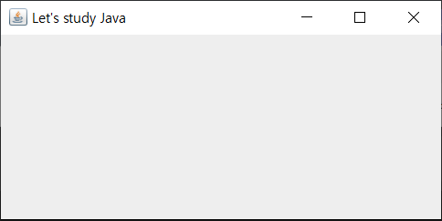
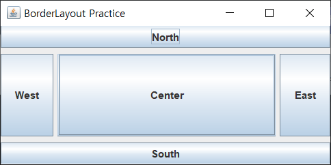
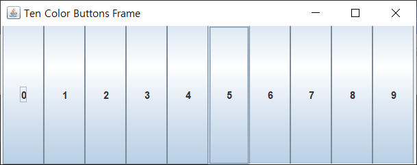
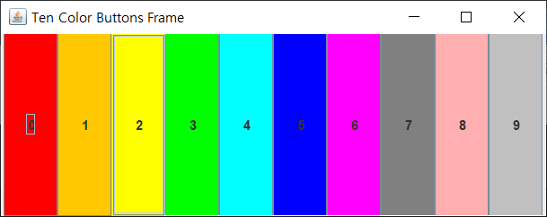
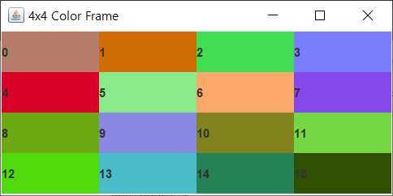
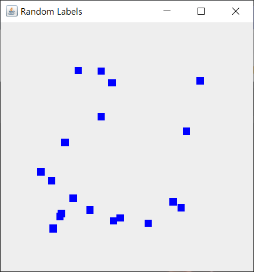
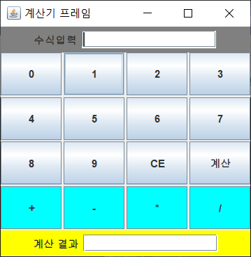
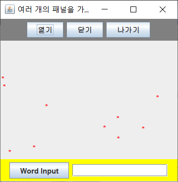

# Chapter 09 Exercise 이론문제
### 자바 GUI 기초, AWT와 스윙(Swing)

# 01
##### 자바에서는 AWT 컴포넌트와 스윙 컴포넌트를 제공한다. 이들 중 어떤 것이 경량 컴포넌트(light weight component)이고, 어떤 것이 중량 컴포넌트(heavy weight component)인가? 그리고 이들은 어떤 점에서 서로 다른가?
##### 스윙(Swing)은 AWT와 달리 순수 자바 언어로 작성되었다. 운영체제의 도움을 받지 않기 때문에 스윙 컴포넌트들은 경량 컴포넌트라고 불린다. 그러므로 스윙 컴포넌트들은 운영체제와 관계없이 항상 동일하게 작동하며 동일한 모양으로 그려진다.

# 02
##### 데스크톱에서 실행되는 GUI 응용프로그램 작성 시 AWT보다 스윙 사용을 권장하는 이유는 무엇인가?
##### 스윙이 경량 컴포넌트이기 때문이다. 또한 AWT보다 스윙 컴포넌트들을 이용하면 보다 화려하며 다양한 모양의 GUI 응용프로그램을 쉽게 개발할 수 있다.

# 03
##### 스윙컴포넌트 : JPanel, JTextField, JLabel
##### AWT : Button

# 04
##### Font, Dimension, Color, Graphics 등은 컴포넌트가 아니지만, 문자의 폰트 설정, 색, 도형 그리기 등 그래픽 작업 시 반드시 필요하다.

# 05
##### 컴포넌트들은 반드시 컨테이너에 부착되어 출력된다.

# 06
##### 컨테이너도 컴포넌트에 한 종류이며 컴포넌트도 배치관리자를 가질 수 있다. 또한 한 컨테이너는 최대 하나의 배치관리자를 가질 수 있다.

# 07
```java

import javax.swing.JFrame;

public class MyFrame extends JFrame {
    public MyFrame() {
        setTitle("hello");
        setSize(200, 300);
        setVisible(true);
    }
    public static void main(String[] args) {
        MyFrame frame = new MyFrame();
    }
}
```

# 08
```java
import javax.swing.JFrame;
import java.awt.*;

public class MyFrame extends JFrame {
    public MyFrame() {
        Container c = getContentPane();
        c.setLayout(new FlowLayout());
        c.setBackground(Color.yellow);
        c.add(new Button("click"));
        setSize(300, 300);
        setVisible(true);
    }
}
```

# 09
```java
Container c;
// 컴포넌트 사이의 수평 수직 간격이 각각 3,4 필셀인 BorderLayout
c.setLayout(new BorderLayout(3, 4));
// 컴포넌트 사이의 수평 수직 간격이 각각 5,6 픽셀이고 오른쪽 정렬하는 FlowLayout
c.setLayout(new FlowLayout(5, 6));
// 컴포넌트 사이의 수평 수직 간격이 각각 7,8 픽셀이고 행수 5, 열수 2인 GridLayout
c.setLayout(new GridLayout(5, 2, 7, 8));
// 현재 등록된 배치관리자 삭제
c.setLayout(null);
```

# 10

```java
import javax.swing.JFrame;
import javax.swing.JButton;

public class MyFrame extends JFrame {
    public MyFrame() {
        Container c = getContentPane();
        getContentPane().setLayout(null);
        JButton btn = new JButton("click");
        btn.setSize(100, 30);
        btn.setLocation(50, 70);
        c.add(btn);
        setSize(300, 300);
        setVisible(true);
    }
    public static void main(String[] args) {
        new MyFrame();
    }
}
```

# Chapter 09 Exercise 실습문제
### 자바 GUI 기초, AWT와 스윙(Swing)

# 01 [MyFrame01.java](./MyFrame01.java)


# 02 [MyFrame02.java](./MyFrame02.java)


# 03 [MyFrame03.java](./MyFrame03.java)


# 04 [MyFrame04.java](./MyFrame04.java)


# 05 [MyFrame05.java](./MyFrame05.java)


# 06 [MyFrame06.java](./MyFrame06.java)


# 07 [MyFrame07.java](./MyFrame07.java)


# 08 [MyFrame08.java](./MyFrame08.java)

