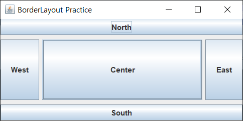
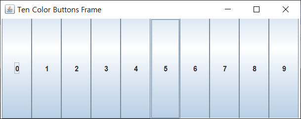
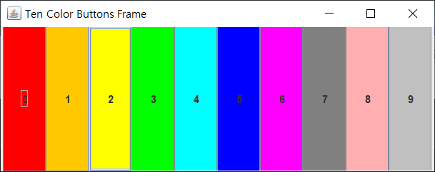
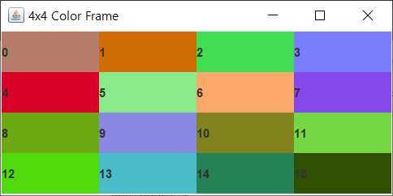
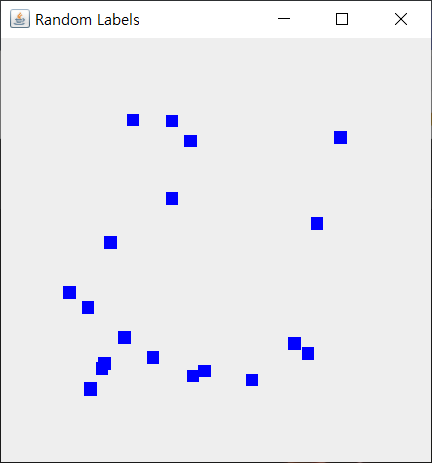
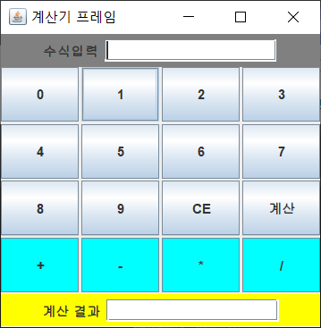
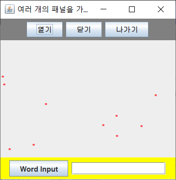

# Chapter 09 Exercise 실습문제
### 자바 GUI 기초, AWT와 스윙(Swing)

# 01 [MyFrame01.java](./MyFrame01.java)

# 02 [MyFrame02.java](./MyFrame02.java)

# 03 [MyFrame03.java](./MyFrame03.java)

# 04 [MyFrame04.java](./MyFrame04.java)

# 05 [MyFrame05.java](./MyFrame05.java)

# 06 [MyFrame06.java](./MyFrame06.java)

# 07 [MyFrame07.java](./MyFrame07.java)

# 08 [MyFrame08.java](./MyFrame08.java)
