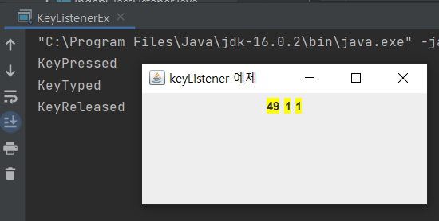
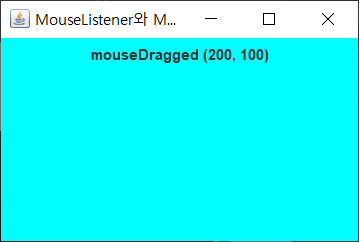

# [IndepClassListener.java](./IndepClassListener.java)
###### 독립 클래스로 Action 이벤트의 리스너 작성

# [InnerClassListener.java](./InnerClassListener.java)
###### 내부 클래스로 Action 이벤트 리스너 만들기

# [AnonymousClassListener](./AnonymousClassListener.java)
###### 익명 클래스로 Action 이벤트 리스너 만들기
###### 결과 GUI 는 InnerClassListener.java 와 같음

# [MouseListenerEx.java](./MouseListenerEx.java)

# [MouseAdapterEx.java](./MouseAdapterEx.java)
###### MouseListenerEx.java 를 MouseAdapter 를 이용하여 메소드 간소화
###### 결과 GUI 는 MouseListenerEx.java 와 같음

# [KeyListenerEx.java](./KeyListenerEx.java)

# [KeyCodeEx.java](./KeyCodeEx.java)

# [FlyingTextEx.java](./FlyingTextEx.java)

# [MouseListenerAllEx.java](./MouseListenerAllEx.java)
###### 마우스가 클릭될 때(Pressed), 클릭 해제할 때(Released), 드래그 할 때(Dragged), 그냥 움직일 때(Moved)
###### 또 커서를 올려놓거나(하늘색) 뗐을 때(노랑색)는 색상이 바뀐다.

# [ClickAndDoubleClickEx.java](./ClickAndDoubleClickEx.java)
###### 더블클릭할 때마다 랜덤으로 배경 색이 바뀐다.

