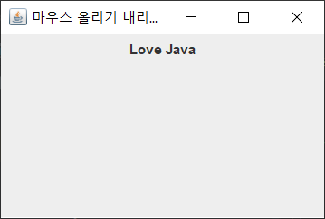
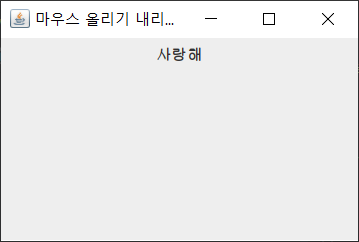
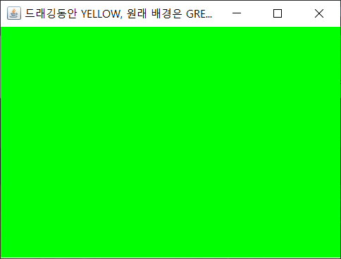
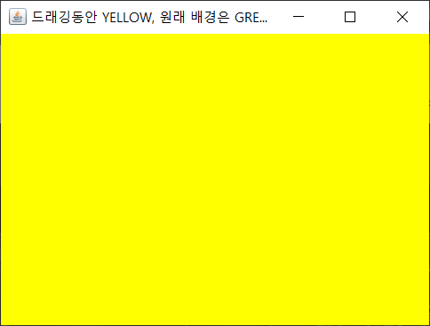
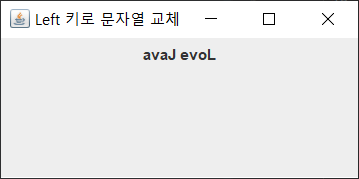
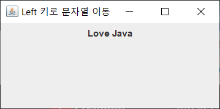
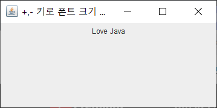
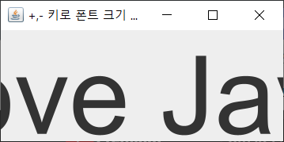
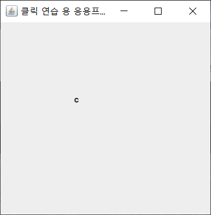
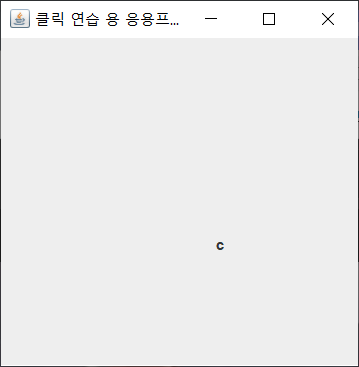

# Chapter 10 Exercise 실습문제
### 자바의 이벤트 처리

# 01 [EventEx01.java](./EventEx01.java)
###### 마우스 올렸을 때(Love Java), 마우스 내렸을 때(사랑해)

# 02 [EventEx02.java](./EventEx02.java)
###### 드래깅 동안만 노란색, 나머지 때는 초록색

# 03 [EventEx03.java](./EventEx03.java)

# 04 [EventEx04.java](./EventEx04.java)

# 05 [EventEx05.java](./EventEx05.java)

# 06 [EventEx06.java](./EventEx06.java)
###### 클릭하는 곳에 c가 배치된다.

# 06 [EventEx07.java](./EventEx07.java)
###### EventEx05.java 와 결과가 같다. 다만 이 코드에서는 마우스 휠을 사용한다.