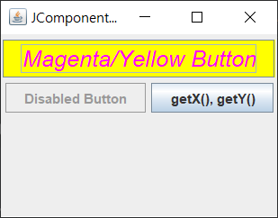
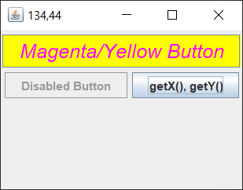
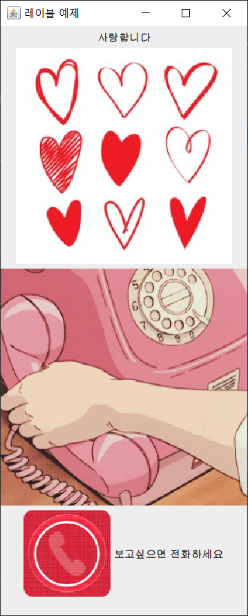
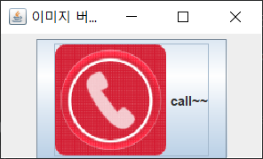
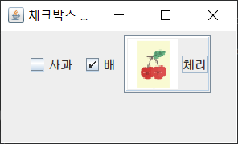
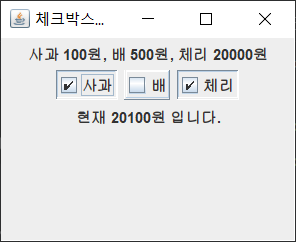
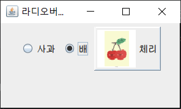
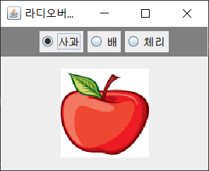
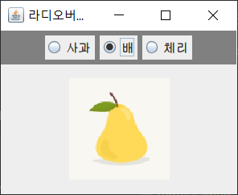
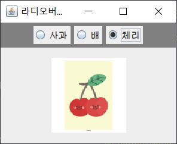

# [JComponentEx.java](./JComponentEx.java)

# [LabelEX.java](./LabelEX.java)

# [ButtonEx.java](./ButtonEx.java)

# [CheckBoxEX.java](./CheckBoxEX.java)

# [CheckBoxItemEventEx.java](./CheckBoxItemEventEx.java)

# [RadioButtonEx.java](./RadioButtonEx.java)
###### 라디오버튼을 그룹으로 묶으면 해당 그룹 중 하나만 선택되게 된다.

# [RadioButtonItemEventEx.java](./RadioButtonItemEventEx.java)

